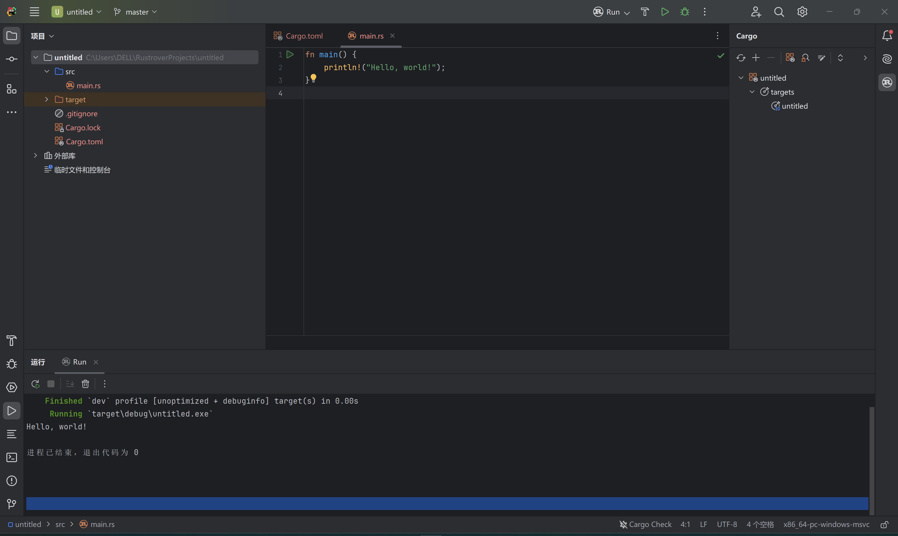

# Rust 学习笔记


# 第一章：入门指南

## 1.1 安装

### 安装 Rust
通过 rustup 下载和安装 Rust，这是一个管理 Rust 版本和相关工具的命令行工具。

#### Linux 和 macOS
1. 打开终端并输入：
   ```bash
   curl --proto '=https' --tlsv1.2 https://sh.rustup.rs -sSf | sh
   ```
2. 安装完成后，需要 C 编译器：
   - macOS: 
     ```bash
     xcode-select --install
     ```
   - Linux:
     ```bash
     sudo apt-get install build-essential
     ```

#### Windows
1. 前往 [Rust 官网](https://www.rust-lang.org/install.html) 并按照说明安装。
2. 安装 Visual Studio 2022 并选择 “使用 C++ 的桌面开发”。

### 验证安装
在命令行中输入：
```bash
rustc --version
```

### 更新与卸载
更新：
```bash
rustup update
```
卸载：
```bash
rustup self uninstall
```

### 查看本地文档
```bash
rustup doc
```
## Image 1


## 1.2 Hello, World!

### 创建项目
通过 Cargo 创建一个新项目：
```bash
cargo new hello_world
cd hello_world
```
项目结构：
- `Cargo.toml`：项目配置文件
- `src/main.rs`：主程序文件

### 编写代码
在 `src/main.rs` 文件中编写以下代码：
```rust
fn main() {
    println!("Hello, world!");
}
```

### 编译与运行
编译项目：
```bash
cargo build
```
运行项目：
```bash
cargo run
```

此过程会显示 "Hello, world!"。

## Image 2



## 1.3 Hello, Cargo!

Cargo 是 Rust 的包管理器和构建系统。通过 Cargo 可以简化创建、编译和管理 Rust 项目。

### 创建项目
```bash
cargo new hello_cargo
cd hello_cargo
```

### 项目结构
- `Cargo.toml`: 配置文件，包含项目元数据和依赖。
- `src/main.rs`: 主程序文件。

### 构建与运行
编译项目：
```bash
cargo build
```
运行项目：
```bash
cargo run
```

### 检查代码
检查代码中潜在问题：
```bash
cargo check
```

## Image 3


---

# 第二章：写个猜数字游戏

## 2.1 新建项目
创建一个新的 Cargo 项目：
```bash
cargo new guessing_game
cd guessing_game
```

## 2.2 编写程序
在 `src/main.rs` 文件中编写以下代码：
```rust
use std::io;

fn main() {
    println!("猜数字游戏！");
    println!("请输入你的猜测：");

    let mut guess = String::new();

    io::stdin()
        .read_line(&mut guess)
        .expect("读取行失败");

    println!("你猜测的数字是：{}", guess);
}
```

## 2.3 添加依赖
在 `Cargo.toml` 文件中添加依赖项：
```toml
[dependencies]
rand = "0.8"
```

## 2.4 生成随机数
在 `src/main.rs` 文件中添加随机数生成：
```rust
use std::io;
use rand::Rng;

fn main() {
    println!("猜数字游戏！");
    let secret_number = rand::thread_rng().gen_range(1..=100);
    println!("秘密数字是：{}", secret_number);

    println!("请输入你的猜测：");
    let mut guess = String::new();

    io::stdin()
        .read_line(&mut guess)
        .expect("读取行失败");

    println!("你猜测的数字是：{}", guess);
}
```

## 2.5 比较猜测与秘密数字
更新 `src/main.rs` 文件：
```rust
use std::io;
use rand::Rng;
use std::cmp::Ordering;

fn main() {
    println!("猜数字游戏！");
    let secret_number = rand::thread_rng().gen_range(1..=100);

    loop {
        println!("请输入你的猜测：");
        let mut guess = String::new();

        io::stdin()
            .read_line(&mut guess)
            .expect("读取行失败");

        let guess: u32 = match guess.trim().parse() {
            Ok(num) => num,
            Err(_) => continue,
        };

        println!("你猜测的数字是：{}", guess);

        match guess.cmp(&secret_number) {
            Ordering::Less => println!("太小了！"),
            Ordering::Greater => println!("太大了！"),
            Ordering::Equal => {
                println!("你赢了！");
                break;
            }
        }
    }
}
```

## 知识点解释
1. **`use std::io;`**：引入标准库的输入输出模块。
2. **`let mut guess = String::new();`**：创建一个可变的字符串变量来存储用户输入。
3. **`io::stdin().read_line(&mut guess)`**：读取用户输入并存储在 `guess` 中。
4. **`rand::thread_rng().gen_range(1..=100);`**：生成1到100之间的随机数。
5. **`match guess.cmp(&secret_number)`**：比较用户猜测与秘密数字，返回 `Ordering` 枚举。
6. **`loop`**：无限循环，直到用户猜对数字为止。
7. **`guess.trim().parse()`**：将用户输入的字符串转换为数字。

## 第三章：常见编程概念

### 3.1 变量与可变性

#### 变量声明
- **声明变量**：使用 `let` 关键字创建变量。默认情况下，Rust 中的变量是不可变的（immutable）。
  ```rust
  let x = 5;
  ```

#### 可变变量
- **可变变量**：使用 `let mut` 关键字声明可变变量，允许对变量的值进行修改。
  ```rust
  let mut x = 5;
  x = 6;
  ```

#### 常量
- **常量声明**：使用 `const` 关键字声明常量，必须显式指定类型，常量在整个程序运行期间保持不变。
  ```rust
  const MAX_POINTS: u32 = 100_000;
  ```

#### 变量遮蔽（Shadowing）
- **遮蔽**：允许在同一作用域内声明同名变量，新变量会遮蔽（覆盖）旧变量。新的变量可以改变类型，并且是不可变的。
  ```rust
  let x = 5;
  let x = x + 1;
  let x = "six"; // 变量 x 的类型从整数变为字符串
  ```

#### 不可变性的重要性
- **不可变性**：默认不可变性帮助防止数据竞争，确保线程安全，提高代码的可读性和可维护性。

### 示例代码
```rust
fn main() {
    // 不可变变量
    let x = 5;
    println!("The value of x is: {}", x);

    // 可变变量
    let mut y = 5;
    println!("The value of y is: {}", y);
    y = 6;
    println!("The value of y is: {}", y);

    // 常量
    const MAX_POINTS: u32 = 100_000;
    println!("The maximum points are: {}", MAX_POINTS);

    // 变量遮蔽
    let z = 5;
    let z = z + 1;
    let z = "six";
    println!("The value of z is: {}", z);
}
```

### 关键点总结
1. **不可变变量**：默认不可变，确保安全性。
2. **可变变量**：使用 `mut` 声明，可修改。
3. **常量**：使用 `const` 声明，需显式类型，全局不变。
4. **遮蔽**：允许重复使用变量名，改变变量类型或值。

### 优势
- **安全性**：默认不可变变量防止数据竞争，确保线程安全。
- **可读性**：代码更容易理解和维护。
- **灵活性**：通过遮蔽和可变变量，提供了灵活的数据处理方式。

## 3.2 数据类型

#### 标量类型 (Scalar Types)
- **整型 (Integer Types)**：用于存储整数。根据大小和符号分为多种类型，如 `i8`, `u8`, `i32`, `u32`, `i64`, `u64` 等。
  - **符号**：`i` 表示有符号，`u` 表示无符号。
  - **大小**：数字表示位数，如 `8` 表示 8 位，`32` 表示 32 位。
  - **示例**：
    ```rust
    let x: i32 = 42;
    let y: u64 = 100;
    ```

- **浮点型 (Floating-Point Types)**：用于存储小数。主要有 `f32` 和 `f64` 两种类型，分别表示 32 位和 64 位浮点数。
  - **示例**：
    ```rust
    let x: f32 = 3.14;
    let y: f64 = 2.71828;
    ```

- **布尔型 (Boolean Type)**：用于存储布尔值，只有两个可能的值：`true` 和 `false`。
  - **示例**：
    ```rust
    let is_rust_fun: bool = true;
    ```

- **字符型 (Character Type)**：用于存储单个 Unicode 字符。表示方式为单引号括起来的字符，如 `'a'`, `'字'`。
  - **示例**：
    ```rust
    let letter: char = 'z';
    let emoji: char = '😊';
    ```

#### 复合类型 (Compound Types)
- **元组 (Tuples)**：将多个值组合在一起，可以包含不同类型的值。元组的长度是固定的。
  - **声明和访问**：
    ```rust
    let tup: (i32, f64, u8) = (500, 6.4, 1);
    let (x, y, z) = tup;
    println!("The value of y is: {}", y);
    ```
  - **通过索引访问**：
    ```rust
    let five_hundred = tup.0;
    let six_point_four = tup.1;
    let one = tup.2;
    ```

- **数组 (Arrays)**：将多个相同类型的值组合在一起。数组的长度是固定的，声明时必须指定长度。
  - **声明和访问**：
    ```rust
    let a = [1, 2, 3, 4, 5];
    let first = a[0];
    let second = a[1];
    ```
  - **数组的类型和长度**：
    ```rust
    let b: [i32; 5] = [1, 2, 3, 4, 5];
    ```

### 关键点总结
1. **整型和浮点型**：用于存储整数和小数，具有不同大小和符号。
2. **布尔型和字符型**：用于存储布尔值和单个字符。
3. **元组**：组合多种类型的固定长度数据。
4. **数组**：组合相同类型的固定长度数据。

### 优势
- **类型安全**：Rust 强类型系统确保数据类型的正确性，防止类型错误。
- **灵活性**：支持多种标量和复合类型，适应不同的编程需求。
- **性能优化**：通过固定长度的复合类型（如元组和数组），提高内存和运行效率。

## 3.3 函数

#### 函数的定义和调用
- **定义函数**：使用 `fn` 关键字定义函数。函数名通常使用蛇形命名法（snake_case）。
  ```rust
  fn main() {
      println!("Hello, world!");
  }
  ```
- **函数参数**：函数可以有多个参数，每个参数需要显式指定类型。
  ```rust
  fn print_value(x: i32) {
      println!("The value is: {}", x);
  }
  ```

#### 返回值
- **返回值类型**：使用箭头 `->` 指定返回值类型。Rust 函数的返回值是表达式而不是语句，因此不用写 `return` 关键字。
  ```rust
  fn five() -> i32 {
      5
  }
  ```
- **带返回值的函数**：
  ```rust
  fn add(x: i32, y: i32) -> i32 {
      x + y
  }
  ```

#### 语句与表达式
- **语句**：执行一些操作但不返回值。例如，变量声明是一个语句。
  ```rust
  let y = 6;
  ```
- **表达式**：计算并返回一个值。函数体内的代码块也是一个表达式。
  ```rust
  let x = 5;
  let y = {
      let x = 3;
      x + 1
  }; // y的值是4
  ```

#### 函数调用
- **调用函数**：通过函数名和参数列表调用函数。
  ```rust
  fn main() {
      let result = add(5, 6);
      println!("The result is: {}", result);
  }
  ```

### 示例代码
```rust
fn main() {
    println!("Hello, world!");

    print_value(10);

    let sum = add(5, 3);
    println!("Sum: {}", sum);

    let num = five();
    println!("Number: {}", num);
}

fn print_value(x: i32) {
    println!("The value is: {}", x);
}

fn add(x: i32, y: i32) -> i32 {
    x + y
}

fn five() -> i32 {
    5
}
```

### 关键点总结
1. **函数定义**：使用 `fn` 关键字，明确参数和返回值类型。
2. **返回值**：使用箭头 `->` 指定返回值类型，最后一个表达式即为返回值。
3. **语句与表达式**：语句不返回值，表达式返回值，函数体内代码块为表达式。
4. **函数调用**：通过函数名和参数列表进行调用。

## 3.4 注释

#### 单行注释
- **单行注释**：使用 `//` 开始单行注释，注释内容从 `//` 开始到行末结束。
  ```rust
  // 这是一个单行注释
  let x = 5; // 这也是一个单行注释
  ```

#### 多行注释
- **多行注释**：使用 `/* */` 包裹多行注释，注释内容可以跨越多行。
  ```rust
  /* 这是一个多行注释
     它可以跨越多行 */
  let x = 5;
  ```

#### 文档注释
- **文档注释**：用于生成文档，单行文档注释使用 `///`，多行文档注释使用 `/** */`。文档注释通常写在函数、结构体等前面。
  ```rust
  /// 这是一个文档注释
  /// 它用于描述接下来的函数
  fn add(x: i32, y: i32) -> i32 {
      x + y
  }
  ```

### 示例代码
```rust
fn main() {
    // 打印 "Hello, world!"
    println!("Hello, world!");

    let x = 5; // 定义一个变量 x 并赋值为 5

    /* 这是一个多行注释
       它可以跨越多行 */
    let y = 10; // 定义一个变量 y 并赋值为 10

    /// 这是一个文档注释
    /// 它用于描述接下来的函数
    fn add(x: i32, y: i32) -> i32 {
        x + y
    }

    let sum = add(x, y);
    println!("Sum: {}", sum);
}
```

### 关键点总结
1. **单行注释**：使用 `//`，适用于简短的注释。
2. **多行注释**：使用 `/* */`，适用于较长的注释。
3. **文档注释**：使用 `///` 或 `/** */`，用于生成文档，描述函数、结构体等。

### 优势
- **可读性**：注释提高代码的可读性和可维护性，帮助理解代码逻辑。
- **文档生成**：文档注释可以自动生成文档，方便维护和使用。
- **调试和测试**：注释可以临时屏蔽代码，方便调试和测试。

## 3.5 控制流

#### if 表达式
- **基本结构**：使用 `if` 关键字进行条件判断。
  ```rust
  let number = 5;

  if number < 10 {
      println!("The number is less than 10");
  } else {
      println!("The number is greater than or equal to 10");
  }
  ```
- **if-else if**：多条件判断。
  ```rust
  let number = 6;

  if number % 4 == 0 {
      println!("The number is divisible by 4");
  } else if number % 3 == 0 {
      println!("The number is divisible by 3");
  } else if number % 2 == 0 {
      println!("The number is divisible by 2");
  } else {
      println!("The number is not divisible by 4, 3, or 2");
  }
  ```

#### 循环
- **loop**：创建无限循环，使用 `break` 退出循环。
  ```rust
  loop {
      println!("This will print forever");
      break; // 退出循环
  }
  ```

- **while**：在条件为真时循环。
  ```rust
  let mut number = 3;

  while number != 0 {
      println!("{}", number);
      number -= 1;
  }
  ```

- **for**：遍历集合中的每一个元素。
  ```rust
  let a = [10, 20, 30, 40, 50];

  for element in a.iter() {
      println!("The value is: {}", element);
  }
  ```

#### Range 语法
- **Range**：创建一个范围，使用 `..` 和 `..=` 语法。
  ```rust
  for number in 1..4 {
      println!("{}", number);
  }

  for number in 1..=4 {
      println!("{}", number);
  }
  ```

### 示例代码
```rust
fn main() {
    // if 表达式
    let number = 6;

    if number % 4 == 0 {
        println!("The number is divisible by 4");
    } else if number % 3 == 0 {
        println!("The number is divisible by 3");
    } else if number % 2 == 0 {
        println!("The number is divisible by 2");
    } else {
        println!("The number is not divisible by 4, 3, or 2");
    }

    // loop 循环
    let mut count = 0;

    loop {
        count += 1;
        if count == 3 {
            break;
        }
    }

    // while 循环
    let mut number = 3;

    while number != 0 {
        println!("{}!", number);
        number -= 1;
    }

    // for 循环
    let a = [10, 20, 30, 40, 50];

    for element in a.iter() {
        println!("The value is: {}", element);
    }

    // Range 语法
    for number in 1..4 {
        println!("{}", number); // 打印 1, 2, 3
    }

    for number in 1..=4 {
        println!("{}", number); // 打印 1, 2, 3, 4
    }
}
```

### 关键点总结
1. **if 表达式**：进行条件判断。
2. **loop 循环**：创建无限循环，使用 `break` 退出。
3. **while 循环**：在条件为真时执行循环。
4. **for 循环**：遍历集合中的元素。
5. **Range 语法**：创建范围，用于循环遍历。

### 优势
- **灵活性**：多种控制流结构适应不同的编程需求。
- **安全性**：通过显式的条件判断和循环控制，提高代码的可读性和安全性。
- **简洁性**：使用简洁的语法进行复杂的控制流操作。

### 优势
- **内存效率**：Slice 不复制数据，仅借用一部分，节省内存。
- **灵活性**：Slice 使函数更通用，可以处理不同类型和长度的数据。
- **安全性**：Rust 确保 Slice 的引用安全，防止悬垂引用和内存泄漏。

# 第四章：认识所有权

## 4.1 什么是所有权？

### 所有权的概念
**所有权**：Rust 中一种管理内存的机制，确保内存安全且无垃圾收集器（GC）。

### 所有权规则
1. Rust 中的每一个值都有一个所有者。
2. 一次只能有一个所有者。
3. 当所有者离开作用域时，值将被丢弃。

### 变量作用域
**作用域**：变量在其声明的作用域内有效，当离开作用域时，变量和其占用的内存会被释放。

```rust
{
    let s = "hello"; // s 在这里是有效的
    // 使用 s
} // 作用域结束，s 被释放
```

### 内存分配与释放
- **堆和栈**：
  - **栈**：存储固定大小的数据，操作快速。
  - **堆**：存储大小不固定的数据，操作相对慢。

### 所有权与函数
传递和返回值时，所有权会转移。

```rust
fn main() {
    let s = String::from("hello"); // s 进入作用域
    takes_ownership(s); // s 的值移动到函数里
    // println!("{}", s); // 此处会出错，s 已失去所有权

    let x = 5; // x 进入作用域
    makes_copy(x); // x 的值被复制到函数里
    println!("{}", x); // x 仍然可以使用
}

fn takes_ownership(some_string: String) { // some_string 进入作用域
    println!("{}", some_string);
} // some_string 在这里移出作用域并调用 `drop` 方法，内存被释放

fn makes_copy(some_integer: i32) { // some_integer 进入作用域
    println!("{}", some_integer);
} // some_integer 在这里移出作用域
```

### 总结
- **所有权**：管理内存的机制，通过一系列规则确保内存安全。
- **作用域**：变量在作用域内有效，离开作用域即释放内存。
- **内存分配**：栈用于固定大小数据，堆用于动态数据。
- **所有权转移**：通过函数传递和返回值时发生。

### 优势
- **内存安全**：确保没有悬垂指针和内存泄漏。
- **无垃圾收集**：无需额外的垃圾回收机制，提高性能。
- **清晰的所有权模型**：帮助开发者明确数据的生命周期。

## 4.2 引用与借用

### 引用
**定义引用**：使用 `&` 符号创建引用，引用指向某个值的内存地址，而不取得所有权。

```rust
let s1 = String::from("hello");
let s2 = &s1; // s2 是 s1 的引用
println!("{}", s2); // 输出 hello
```

### 可变引用
**定义可变引用**：使用 `&mut` 创建可变引用，允许修改引用指向的值。

```rust
let mut s = String::from("hello");
let s1 = &mut s; // s1 是 s 的可变引用
s1.push_str(", world");
println!("{}", s1); // 输出 hello, world
```

### 规则
- 在同一作用域中，同时只能有一个可变引用，或多个不可变引用，但不能同时存在。
- 可变引用防止数据竞争，确保内存安全。

### 悬垂引用
**悬垂引用**：当引用的值被释放后，引用指向的内存无效，成为悬垂引用。Rust 编译器防止悬垂引用的产生。

```rust
let reference_to_nothing = dangle();

fn dangle() -> &String {
    let s = String::from("hello");
    &s // 错误：返回一个悬垂引用
} // s 在这里被释放，引用指向无效内存
```

### 引用与所有权
**传递引用**：通过引用传递值而不转移所有权。

```rust
fn main() {
    let s1 = String::from("hello");
    let len = calculate_length(&s1);
    println!("The length of '{}' is {}.", s1, len);
}

fn calculate_length(s: &String) -> usize {
    s.len()
}
```

### 示例代码
```rust
fn main() {
    // 不可变引用
    let s1 = String::from("hello");
    let s2 = &s1;
    println!("{}", s2);

    // 可变引用
    let mut s = String::from("hello");
    let s1 = &mut s;
    s1.push_str(", world");
    println!("{}", s1);

    // 传递引用
    let s1 = String::from("hello");
    let len = calculate_length(&s1);
    println!("The length of '{}' is {}.", s1, len);
}

fn calculate_length(s: &String) -> usize {
    s.len()
}
```

### 关键点总结
- **引用**：使用 `&` 符号创建引用，指向值的内存地址而不取得所有权。
- **可变引用**：使用 `&mut` 创建可变引用，同时只能有一个可变引用或多个不可变引用。
- **悬垂引用**：引用指向的值被释放后，引用成为悬垂引用，Rust 编译器防止此情况。
- **传递引用**：通过引用传递值而不转移所有权，提高效率。

### 优势
- **内存安全**：引用和借用机制确保内存安全，防止数据竞争和悬垂引用。
- **高效传递**：通过引用传递数据，不复制大块内存，提高程序性能。
- **清晰所有权模型**：明确数据的所有权和生命周期，简化内存管理。

## 4.3 Slice 类型

### 什么是 Slice
**Slice**：引用集合中一部分元素的引用，不拥有数据，仅借用数据的一部分。

### 字符串 Slice
**定义字符串 Slice**：使用 `&str` 表示字符串 Slice。

```rust
let s = String::from("hello world");
let hello = &s[0..5]; // 包含索引0到4的字符串部分
let world = &s[6..11]; // 包含索引6到10的字符串部分
```

### 简化写法
```rust
let s = String::from("hello world");
let hello = &s[..5]; // 从字符串开头到索引4
let world = &s[6..]; // 从索引6到字符串结尾
let whole = &s[..]; // 整个字符串
```

### 字符串字面值是 Slice
**字符串字面值**：字符串字面值是不可变的 Slice。

```rust
let s = "hello world"; // s 是 &str 类型
```

### Slice 的使用
**函数参数中的 Slice**：可以用 Slice 类型参数替代具体类型，使函数更通用。

```rust
fn first_word(s: &str) -> &str {
    let bytes = s.as_bytes();
    for (i, &item) in bytes.iter().enumerate() {
        if item == b' ' {
            return &s[0..i];
        }
    }
    &s[..]
}
```

### 示例代码
```rust
fn main() {
    let s = String::from("hello world");

    // 字符串 Slice
    let hello = &s[0..5];
    let world = &s[6..11];
    println!("{} {}", hello, world);

    // 字符串字面值
    let s = "hello world";

    // 函数参数中的 Slice
    let word = first_word(&s);
    println!("The first word is: {}", word);
}

fn first_word(s: &str) -> &str {
    let bytes = s.as_bytes();
    for (i, &item) in bytes.iter().enumerate() {
        if item == b' ' {
            return &s[0..i];
        }
    }
    &s[..]
}
```

### 关键点总结
- **Slice**：引用集合中一部分元素的引用，不拥有数据，仅借用。
- **字符串 Slice**：使用 `&str` 表示，引用字符串的一部分。
- **字符串字面值是 Slice**：字符串字面值是不可变的 `&str`。
- **函数参数中的 Slice**：用 Slice 类型参数替代具体类型，使函数更通用。

# 第五章：使用结构体组织相关联的数据

## 5.1 定义和实例化结构体

### 定义结构体

在Rust中，使用`struct`关键字定义结构体，结构体可以包含多个不同类型的字段。

```rust
struct User {
    username: String,
    email: String,
    sign_in_count: u64,
    active: bool,
}
```

上述代码定义了一个名为`User`的结构体，其中包含四个字段：`username`、`email`、`sign_in_count`和`active`。

### 实例化结构体

实例化结构体时，需为每个字段指定具体的值：

```rust
let user1 = User {
    email: String::from("someone@example.com"),
    username: String::from("someusername123"),
    active: true,
    sign_in_count: 1,
};
```

上述代码创建了一个`User`结构体实例`user1`，并为其所有字段赋值。

### 访问结构体字段

可以通过点号`.`访问结构体的字段：

```rust
println!("Username: {}", user1.username);
println!("Email: {}", user1.email);
```

### 修改结构体字段

结构体字段的值可以被修改，但前提是结构体实例必须是可变的：

```rust
let mut user1 = User {
    email: String::from("someone@example.com"),
    username: String::from("someusername123"),
    active: true,
    sign_in_count: 1,
};

user1.email = String::from("anotheremail@example.com");
```

### 使用结构体更新语法

可以基于已有结构体实例创建新的实例：

```rust
let user2 = User {
    email: String::from("another@example.com"),
    ..user1
};
```

上述代码创建了一个新的结构体实例`user2`，其`username`、`active`和`sign_in_count`字段的值与`user1`相同，只有`email`字段被赋予了新的值。

### 使用元组结构体

元组结构体类似于普通结构体，但字段没有名称，只有类型：

```rust
struct Color(i32, i32, i32);
struct Point(i32, i32, i32);

let black = Color(0, 0, 0);
let origin = Point(0, 0, 0);
```

### 示例代码

综合上述知识点的完整示例：

```rust
struct User {
    username: String,
    email: String,
    sign_in_count: u64,
    active: bool,
}

fn main() {
    let mut user1 = User {
        email: String::from("someone@example.com"),
        username: String::from("someusername123"),
        active: true,
        sign_in_count: 1,
    };

    user1.email = String::from("anotheremail@example.com");

    let user2 = User {
        email: String::from("another@example.com"),
        ..user1
    };

    println!("User1's email: {}", user1.email);
    println!("User2's email: {}", user2.email);
}
```

## 5.2 使用结构体的示例程序

### 示例程序：存储用户信息

我们将编写一个程序，通过结构体存储和管理用户的信息，包括用户名、电子邮件、登录次数和账户是否激活。

```rust
struct User {
    username: String,
    email: String,
    sign_in_count: u64,
    active: bool,
}

fn main() {
    let user1 = User {
        email: String::from("someone@example.com"),
        username: String::from("someusername123"),
        active: true,
        sign_in_count: 1,
    };

    println!("Username: {}", user1.username);
    println!("Email: {}", user1.email);
    println!("Sign in count: {}", user1.sign_in_count);
    println!("Active: {}", user1.active);
}
```

### 解释

1. **定义结构体**：使用 `struct` 关键字定义 `User` 结构体，包含四个字段。
2. **创建实例**：使用结构体名称 `User` 创建实例 `user1`，并为其字段赋值。
3. **访问字段**：通过点号 `.` 访问 `user1` 的字段，并打印字段值。

### 扩展功能

我们可以扩展这个示例，通过函数创建用户：

```rust
fn build_user(email: String, username: String) -> User {
    User {
        email,
        username,
        active: true,
        sign_in_count: 1,
    }
}

fn main() {
    let user1 = build_user(String::from("someone@example.com"), String::from("someusername123"));
    
    println!("Username: {}", user1.username);
    println!("Email: {}", user1.email);
    println!("Sign in count: {}", user1.sign_in_count);
    println!("Active: {}", user1.active);
}
```

### 总结

通过使用结构体和函数，我们可以更高效地管理和操作相关联的数据。此示例展示了如何定义、实例化和操作结构体，帮助我们更好地组织代码。

## 5.3 方法语法

在Rust中，方法是附加在结构体、枚举或特性上的函数。方法可以访问结构体的字段，并且可以通过`self`参数获取调用该方法的实例。方法定义在`impl`（implementation）块中。

### 定义方法

定义一个方法，它可以访问结构体的字段：

```rust
struct Rectangle {
    width: u32,
    height: u32,
}

impl Rectangle {
    fn area(&self) -> u32 {
        self.width * self.height
    }
}

fn main() {
    let rect1 = Rectangle {
        width: 30,
        height: 50,
    };

    println!("The area of the rectangle is {} square pixels.", rect1.area());
}
```

### 解释

1. **定义结构体**：`Rectangle`结构体包含`width`和`height`两个字段。
2. **方法定义**：在`impl`块中定义`area`方法。`&self`表示方法借用了调用它的结构体实例，方法返回矩形的面积。
3. **调用方法**：通过实例`rect1`调用`area`方法，计算矩形的面积。

### 关联函数

关联函数是没有`self`参数的方法，通常用作构造函数：

```rust
impl Rectangle {
    fn square(size: u32) -> Rectangle {
        Rectangle {
            width: size,
            height: size,
        }
    }
}

fn main() {
    let sq = Rectangle::square(3);
    println!("The square has width {} and height {}.", sq.width, sq.height);
}
```

### 解释

1. **定义关联函数**：`square`函数返回一个`Rectangle`实例，其`width`和`height`相等。
2. **调用关联函数**：通过`Rectangle::square(3)`调用关联函数，创建一个正方形实例。

### 总结

方法和关联函数通过`impl`块实现，为结构体提供了操作和构造实例的功能。通过方法，结构体实例可以执行操作，而关联函数则通常用于创建新的结构体实例。
